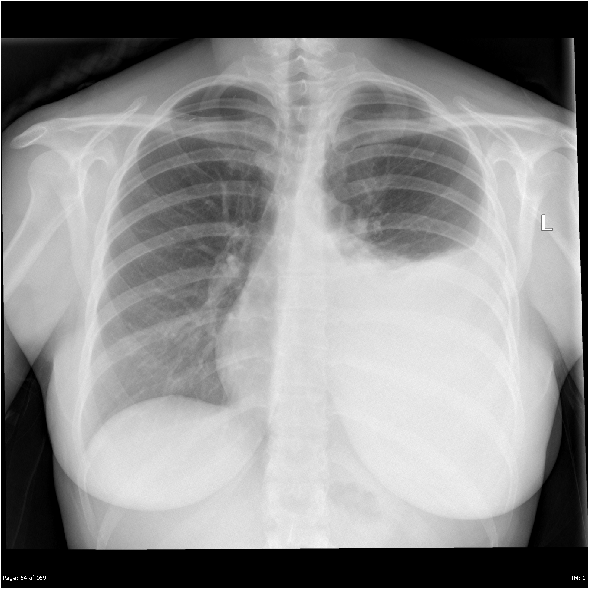

radio-star
==============================

[](https://travis-ci.com/woodytwoshoes/Radio-Star)

To run
```
python -m radio-star-demo
```
Note: If running app without appropriate S3 credentials, the S3 bucket name and folder will need configuration. Email me for access, as access is restricted as per the Stanford Chexpert agreement.

### What is Radio-Star?

An app used to search for and present case and control images to radiologist in order to facilitate more accurate interpretation.

Project Organization
------------

    ├── LICENSE
    ├── Makefile           <- Makefile with commands like `make data` or `make train`
    ├── README.md          <- The top-level README for developers using this project.
    ├── data
    │   ├── external       <- Data from third party sources.
    │   ├── interim        <- Intermediate data that has been transformed.
    │   ├── processed      <- The final, canonical data sets for modeling.
    │   └── raw            <- The original, immutable data dump.
    │
    ├── notebooks          <- Jupyter notebooks. Experiments, records, images, presentations.
    │                         
    │                         
    ├── setup.py           <- makes project pip installable (pip install -e .) so radio-star-demo can be imported
    ├── radio-star-demo                <- Source code for use in this project.
    │   ├── __init__.py    <- Makes radio-star-demo a Python module
    │   │
    │   ├── data           <- data as it flows through the luigi pipeline
    │   │   ├── external       <- Data from third party sources.
    │   │   ├── interim        <- Intermediate data that has been transformed.
    │   │   ├── processed      <- The final, canonical data sets for modeling.
    │   │   └── raw            <- The original, immutable data dump.
    │   │
    │   │
    │   ├── models                   
    │   │   ├── helper functions <- Scripts to assist in doing vector calculations on dataframes, and manipualting images
    │   │   └── Tasks <-- Tasks which can be run in Luigi pipeline to achieve analysis and display results.
    │   │
    │   └── visualization  <- Scripts to create exploratory and results oriented visualizations
    │       └── visualize.py <- script to generate PCA visualization of results


--------

<p><small>Project based on the <a target="_blank" href="https://drivendata.github.io/cookiecutter-data-science/">cookiecutter data science project template</a>. #cookiecutterdatascience</small></p>

# Radio-Star - Michael Woodburn
- retrieves useful images for Radiologists to view when making interpretations. Virtual twin studies.

AI  in Radiology. Geoffrey Hinton, Jeremy Howard, fastai, Stanford

Hospital current practices, regulations, monopolies vs innovators, ambitions, conferences, hyperproductive type As.


## Commonly dentified radiological features

### Pneumonia (Right Lobe Consolidation)
- pus inside the airways inside the lung, which you cough out.


### Left-sided pleural effusion
- fluid leaking out of the lung into the chest cavity



### Left-sided pneumothorax
- air leaking out of the lung into the chest cavity


## What does our data look like?
|       | Sex    |   Age | Frontal/Lateral   | AP/PA   | No Finding   | Enlarged Cardiomediastinum   | Cardiomegaly   | Lung Opacity   | Lung Lesion   | Edema       | Consolidation   | Pneumonia   | Atelectasis   | Pneumothorax   | Pleural Effusion   | Pleural Other   | Fracture    | Support Devices   |
|------:|:-------|------:|:------------------|:--------|:-------------|:-----------------------------|:---------------|:---------------|:--------------|:------------|:----------------|:------------|:--------------|:---------------|:-------------------|:----------------|:------------|:------------------|
| 78414 | Female |    40 | Frontal           | AP      | unmentioned  | unmentioned                  | unmentioned    | POSITIVE       | unmentioned   | unmentioned | unmentioned     | POSITIVE    | unmentioned   | POSITIVE       | unmentioned        | unmentioned     | unmentioned | unmentioned       |

- These features are derived from the freetext radiology reports written by Radiologist doctors.

We have our raw data here


## Using vector operations, we can find similar images - VIRTUAL TWIN STUDIES

If I write the software badly


If I write the software well


- these images have similar mentions of features, and similar feature values, with one chosen difference

|       | Sex    |   Age | Frontal/Lateral   | AP/PA   | No Finding   | Enlarged Cardiomediastinum   | Cardiomegaly   | Lung Opacity   | Lung Lesion   | Edema       | Consolidation   | Pneumonia   | Atelectasis   | Pneumothorax   | Pleural Effusion   | Pleural Other   | Fracture    | Support Devices   |
|------:|:-------|------:|:------------------|:--------|:-------------|:-----------------------------|:---------------|:---------------|:--------------|:------------|:----------------|:------------|:--------------|:---------------|:-------------------|:----------------|:------------|:------------------|
| 78414 | Female |    40 | Frontal           | AP      | unmentioned  | unmentioned                  | unmentioned    | POSITIVE       | unmentioned   | unmentioned | unmentioned     | POSITIVE    | unmentioned   | POSITIVE       | unmentioned        | unmentioned     | unmentioned | unmentioned       |
| 29247 | Female |    40 | Frontal           | AP      | unmentioned  | unmentioned                  | unmentioned    | POSITIVE       | unmentioned   | unmentioned | unmentioned     | NEGATIVE    | NEGATIVE      | POSITIVE       | POSITIVE           | unmentioned     | unmentioned | unmentioned       |


|       | Sex    |   Age | Frontal/Lateral   | AP/PA   | No Finding   | Enlarged Cardiomediastinum   | Cardiomegaly   | Lung Opacity   | Lung Lesion   | Edema       | Consolidation   | Pneumonia   | Atelectasis   | Pneumothorax   | Pleural Effusion   | Pleural Other   | Fracture    | Support Devices   |
|------:|:-------|------:|:------------------|:--------|:-------------|:-----------------------------|:---------------|:---------------|:--------------|:------------|:----------------|:------------|:--------------|:---------------|:-------------------|:----------------|:------------|:------------------|
| 78414 | Female |    40 | Frontal           | AP      | unmentioned  | unmentioned                  | unmentioned    | POSITIVE       | unmentioned   | unmentioned | unmentioned     | POSITIVE    | unmentioned   | POSITIVE       | unmentioned        | unmentioned     | unmentioned | unmentioned       |
| 43170 | Female |    78 | Frontal           | AP      | unmentioned  | POSITIVE                     | POSITIVE       | POSITIVE       | unmentioned   | NEGATIVE    | unmentioned     | POSITIVE    | unmentioned   | NEGATIVE       | POSITIVE           | unmentioned     | unmentioned | unmentioned       |


## We want to organise these images so that it is easy to retrieve the images that are useful.
- there are some correlations within the data that may assist us


# How to navigate this space?


## A few principles

- Useful images will likely be found nearby in the feature space, so indexing is important
- the database is likely to be updated frequently. New images are likely to be added, and new features may be introduced at any stage.
- we want to minimize computation, makinfg maximal use of dask and cython.
- we want deterministic results
- we have to strike a balance between recalculating when new data is available vs using memoized results.
- our aim is to organise and present images to a user.

## Assumption

- assume that we do not have control of the databse (it belongs to Stanford). We only have access.
- therefore we have to achieve some version control on our own system and generalize our functions to accommodate changes

## Useful Packages

### Boto 
- querying an S3 bucket. This allows us to provide cloud access to users and control and track access via credential management (IP protection and patient privacy)

### Django TODO
- to manage the feature database which corresponds to the images. 

### Luigi 
- to create data processing Pipelines with intermediate writes so we don't have to repeat calculations. Intermediate files to be salted based on data.

### Docker TODO
- it may be possible to derive additional features for similar images that can be shared back with the user via deep learning modules. These can be built into the Luigi pipeline via a micro environment. The goal is to minimize the headache assosicated with deep learning libraries and CUDA.

## Advanced Python

### Optimization and memoization DONE
- to deal with a large dataset
- opportunity to use a space filling curve

### Flexible parsing of user inputs.
- to accommdate various country's terminology of radiological findings


### Metaclasses and composition TODO
- within Luigi, to achieve multiple-image outputs.